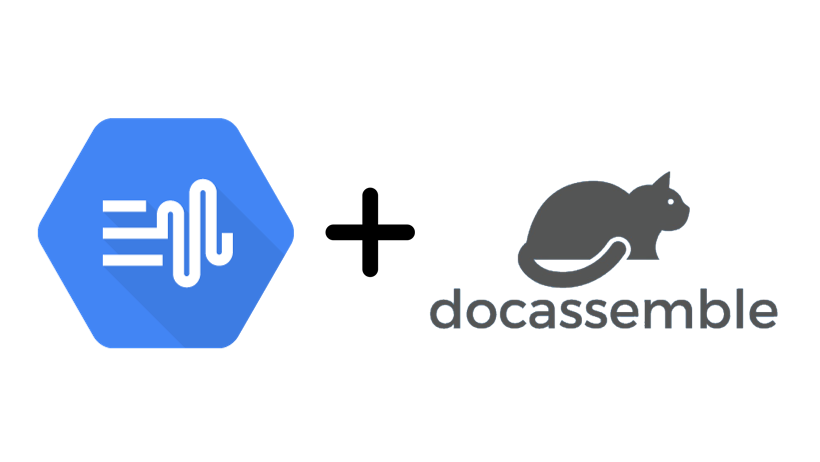

# docassemble-googleTTS

A docassemble interview that performs text to speech with Google Cloud.

## What you need

1. Install this interview in your docassemble.
2. Go to the Configuration and set the `tts service account` subdirective 
   under the `google` directive. 
   Set it to a service account. 
   ([See here for details](https://docassemble.org/docs/functions.html#google%20sheets%20example) 
   how to do it, but note the different subdirective.)
3. Run interview. Make your text talk!

## Limitations

* Only Wavenet US voices can be selected.
* Code doesn't check whether you exceed a quota or incur charges
* No errors are returned when request (background action) 
  to google fails
  * Can't find a service account/ Unauthorised
  * Google Text To Speech API not enabled

## License

MIT License (C) 2022 Ang Hou Fu

Permission is hereby granted, free of charge,to any person 
obtaining a copy of this software and associated documentation 
files (the "Software"), to deal in the Software 
without restriction, including without limitation 
the rights to use, copy, modify, merge, publish, distribute, 
sublicense, and/or sell copies of the Software, 
and to permit persons to whom the Software is furnished to do so, 
subject to the following conditions:

The above copyright notice and this permission notice shall be
included in all copies or substantial portions of the Software.

THE SOFTWARE IS PROVIDED "AS IS", WITHOUT WARRANTY OF ANY KIND, 
EXPRESS OR IMPLIED, INCLUDING BUT NOT LIMITED TO THE WARRANTIES 
OF MERCHANTABILITY, FITNESS FOR A PARTICULAR PURPOSE 
AND NONINFRINGEMENT. IN NO EVENT SHALL THE AUTHORS OR COPYRIGHT 
HOLDERS BE LIABLE FOR ANY CLAIM, DAMAGES OR OTHER LIABILITY, 
WHETHER IN AN ACTION OF CONTRACT, TORT OR OTHERWISE, ARISING FROM, 
OUT OF OR IN CONNECTION WITH THE SOFTWARE OR THE USE OR OTHER 
DEALINGS IN THE SOFTWARE.